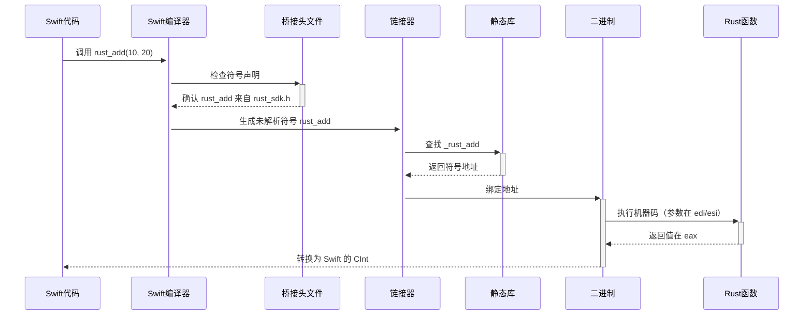

## April 24, 2025

导师发布了课题，具体见这个文档：

[课题详情](https://www.notion.so/1df2ad4d787280e5be1ce5da029ac72f?pvs=21)

## April 25, 2025

跟着这个教程走进了UIKit开发。

[Intro to Programmatic UI - UIKit | Xcode 14](https://youtu.be/_U6_l58Cv4E?si=YLAATJdj3vdpkA-s)

跟着这个教程，我学会了UITableView+自定义Cell的使用。

[UITableView Tutorial w/ Custom Cells - Programmatic - Swift 5 - Xcode 11](https://www.youtube.com/watch?v=bXHinfFMkFw&t=1061s)

### 初始化项目

---

**删除Storyboard**

1. 在导航栏中删除文件
2. 在plist中删除「Main storyboard file base name」
3. 在导航栏中搜索storyboard，点击UISceceStoryboardFile，删除Storyboard Name

---

**更新文件**

- 基础版
  ```swift
  guard let windowScene = (scene as? UIWindowScene) else { return }

  window = UIWindow(frame: windowScene.coordinateSpace.bounds)
  window?.windowScene = windowScene
  window?.rootViewController = FirstScreen()
  window?.makeKeyAndVisible()
  ```
- 导航栏版
  ```swift
  guard let windowScene = (scene as? UIWindowScene) else { return }

  let navController = UINavigationController(rootViewController: ViewController())
  navController.navigationBar.prefersLargeTitles = true

  window = UIWindow(frame: windowScene.coordinateSpace.bounds)
  window?.windowScene = windowScene
  window?.rootViewController = navController
  window?.makeKeyAndVisible()
  ```

同时，可以将ViewController重命名为FirstScreen。

---

**新建文件**

选择「Cocoa Touch Class」，即UIKit 框架中的类（如 UIViewController、UIView）的子类。

---

### 样式的应用

有两种更改组件样式的方式，一种是直接在组件的实例上访问样式并进行更改。这种方式不推荐，因为状态管理复杂，并且代码零散：

```swift
button.backgroundColor = .systemMint
```

比较现代式的方法是通过Configuration结构体进行样式的更改，且内置状态切换和动画：

```swift
button.configuration = .filled()
```

### Swift的类型推断

Swift 允许在上下文明确时省略类型名，直接使用 .member。编译器能通过上下文推断出变量的类型。

```swift
let nextButton = UIButton()
nextButton.configuration = .filled() // 等价于 UIButton.Configuration.filled()
```

nextButton.configuration 的类型是 UIButton.Configuration，Swift 推断出 .filled() 是 UIButton.Configuration.filled() 的简写。

### 使用代码进行布局

---

**AutoLayout**

禁用视图的自动布局转换，防止 UIKit 将 frame 和 autoresizingMask 转为约束。要使用AutoLayout，就必须进行该设置。

```swift
nextButton.translatesAutoresizingMaskIntoConstraints = false
```

---

**添加约束**

```swift
nextButton.centerXAnchor.constraint(equalTo: view.centerXAnchor).isActive = true
```

- **nextButton.centerXAnchor**：nextButton（一个 UIView 子类，如 UIButton）的 X 轴中心锚点。
- **view.centerXAnchor**：父视图 view（UIViewController 的主视图）的 X 轴中心锚点。
- **.constraint(equalTo:)**：创建一条约束，指定 nextButton 的 X 轴中心等于 view 的 X 轴中心。
- **.isActive = true**：激活这条约束，使其生效，立即应用到 AutoLayout 系统。

---

**批量激活约束**

```swift
NSLayoutConstraint.activate([
    nextButton.centerXAnchor.constraint(equalTo: view.centerXAnchor)
])
```

这样就不用在每个constraint上都调用**`.isActive = true`**了。

---

**工具扩展**

可以使某个视图充满父容器。由于该逻辑较为常用，因此可以进行封装复用。

```swift
import UIKit

extension UIView {

    func pin(to superView: UIView) {
        translatesAutoresizingMaskIntoConstraints = false
        NSLayoutConstraint.ba shactivate([
            topAnchor.constraint(equalTo: superView.topAnchor),
            leadingAnchor.constraint(equalTo: superView.leadingAnchor),
            trailingAnchor.constraint(equalTo: superView.trailingAnchor),
            bottomAnchor.constraint(equalTo: superView.bottomAnchor)
        ])
    }
}
```

### 关于UIViewController

应用中的各个屏幕就像一堆牌，通过类似push和pop的操作来实现屏幕之间的跳转。


### Naming Convention

- ViewController常用VC代替

### 最佳实践

- viewDidLoad中的代码尽量简洁，可以通过函数调用来达到这一目的

UITableViewCell中需要定义两种视图的初始化方法：

1. override：覆盖原始的初始化方法
2. required：用于使用storyboard来定义视图。就算是使用代码来初始化视图，Swift还是要求定义required init。

```swift
class VideoCell: UITableViewCell {

    override init(style: UITableViewCell.CellStyle, reuseIdentifier: String?) {
        super.init(style: style, reuseIdentifier: reuseIdentifier)
    }

    required init?(coder: NSCoder) {
        fatalError("init(coder:) has not been implemented")
    }

}
```

### UIImageView

如果没有**`videoImageView.clipsToBounds = true`**，圆角显示不出来。因此，我认为这行代码对应RN中的resizeMode=‘cover’。

```swift
func configureImageView() {
    videoImageView.layer.cornerRadius = 10
    videoImageView.clipsToBounds = true
}
```

```swift
func setImageConstraints() {
    videoImageView.translatesAutoresizingMaskIntoConstraints = false
    NSLayoutConstraint.activate([
        videoImageView.centerYAnchor.constraint(equalTo: centerYAnchor),
        videoImageView.leadingAnchor.constraint(equalTo: leadingAnchor, constant: 12),
        videoImageView.heightAnchor.constraint(equalToConstant: 80),
        videoImageView.widthAnchor.constraint(equalTo: videoImageView.heightAnchor, multiplier: 16/9)
    ])
}
```

### UILabel

熟悉吗？太熟了。

```swift
func configureTitleLabel() {
    videoTitleLabel.numberOfLines = 1
    videoTitleLabel.adjustsFontSizeToFitWidth = true
}
```

注意，这里的padding，如果在右边，要用负数。

```swift
func setTitleLabelConstraints() {
        videoTitleLabel.translatesAutoresizingMaskIntoConstraints = false
        NSLayoutConstraint.activate([
            videoTitleLabel.centerYAnchor.constraint(equalTo: centerYAnchor),
            videoTitleLabel.leadingAnchor.constraint(equalTo: videoImageView.trailingAnchor, constant: 20),
            videoTitleLabel.heightAnchor.constraint(equalToConstant: 80),
            videoTitleLabel.trailingAnchor.constraint(equalTo: trailingAnchor, constant: -12),
        ])
    }
```

## April 26, 2025

### UITableView

与UITableView相关的代码，是实现列表功能的核心。

[Filling a table with data | Apple Developer Documentation](https://developer.apple.com/documentation/uikit/filling-a-table-with-data)

官方文档中，对于表格数据填充方法的解释

首先，要明白Swift严格遵循MVC思想。因此，视图的渲染和数据的处理之间是一种松耦合的关系。

因此，视图不直接访问模型，控制器通过协议（如 **`DataSource`** 和 **`Delegate`**）间接管理视图行为。

其中，用于管理表格数据的 **`UITableViewDataSource`** 协议是核心。通过协议扩展 **`UIViewController`** ，可以实现表格数据的填充操作。

```swift
extension VideoListVC: UITableViewDelegate, UITableViewDataSource { }
```

根据官方文档：https://developer.apple.com/documentation/uikit/uitableviewdatasource， **`UITableViewDataSource`** 有两个必须实现的方法：

```swift
override func tableView(_ tableView: UITableView, numberOfRowsInSection section: Int) -> Int {
   return 0
}
```

```swift

// Provide a cell object for each row.
override func tableView(_ tableView: UITableView, cellForRowAt indexPath: IndexPath) -> UITableViewCell {
   // Fetch a cell of the appropriate type.
   let cell = tableView.dequeueReusableCell(withIdentifier: "cellTypeIdentifier", for: indexPath)

   // Configure the cell’s contents.
   cell.textLabel!.text = "Cell text"

   return cell
}
```

第二个函数在Cell即将进入屏幕视区时被调用。要理解这个函数，就要先理解为什么需要这个函数。

---

**1、为UITableView注册Cell**

UITableView是由一系列的Cell组成的。由于Cell可以自定义样式和内容，因此在注册Cell的时候，会传入一个标识符，简单来说就是给某个种类的Cell起个名字：

```swift
tableView.register(VideoCell.self, forCellReuseIdentifier: Cells.videoCell)
```

这里的第一个参数，不使用**`VideoCell`**，而是使用**`Video.self`**的原因是：该参数接收的是一个类型，而不是一个具体的单元格实例。

- **`Video.self`**：**`VideoCell`** 类的类型对象，表示 **`VideoCell`** 这个类
- **`VideoCell`**：表示一个 **`VideoCell`** 类型的实例

---

**2、UITableView的工作原理**

因为在Swift中，组件的生命周期都是要由开发者进行管理的；这对于TableView也是同理。

首先要理解TableView的原理：**`UITableView`** 使用复用机制来优化性能；当单元格滚出屏幕时，它不会被销毁，而是被放入一个复用池。

当需要显示新的单元格时，**`dequeueReusableCell`** 会从复用池中取出一个单元格，而不是每次都创建新对象。

当然，如果在TableView首次渲染的时候，池中没有与之前通过「register-注册」匹配的类型，它会创建一个新的 VideoCell。

<aside>
💡

**`enqueueReusableCell`？**

与将Cell从复用池中取出的函数**`dequeueReusableCell`**不同的是，系统并没有提供 Cell 被放入复用池的“入队”函数，这个过程是 UITableView 内部实现的，不需要开发者手动调用，也没有任何公开的方法让开发者直接干预。

尽管无法直接干预Cell进入复用池的过程，开发者可以间接监听 Cell 离开屏幕的行为：

```swift
func tableView(_ tableView: UITableView, didEndDisplaying cell: UITableViewCell, forRowAt indexPath: IndexPath) {
    print("Cell at \(indexPath.row) is no longer displayed")
}
```

</aside>

---

**3、在UITableView中使用Cell**

理解了这个函数的调用时机（调用频繁，每当新的Cell即将进入视区时就会调用）之后，理解它的作用就相对轻松一些。

```swift
func tableView(_ tableView: UITableView, cellForRowAt indexPath: IndexPath) -> UITableViewCell {
    let cell = tableView.dequeueReusableCell(withIdentifier: Cells.videoCell) as! VideoCell
    let video = videos[indexPath.row]
    cell.set(video: video)

    return cell
}
```

1）从复用池中取出一个Cell。需要注意的是，这里取出的Cell只是一个空壳（shell），并没有实际的数据

2）在调用该函数的时候，系统会将该Cell的位置（indexPath）以参数的形式传入。因此就可以通过该位置参数，作为下标进行访问存储视频的数组

<aside>
💡

**indexPath是什么？**

indexPath 是 UIKit 框架中的一个对象，类型为 IndexPath，用于标识类似表格或集合视图的 UI 组件中某个具体项的位置；包含两个主要属性：

- section：一个整数，表示项所在的分区（section）
- row：一个整数，表示该分区内的行号（row）
</aside>

3）为Cell Shell设置实际的数据；此时的Cell才是具有实际数据的单元格

---

**4、测试UITableView的实际行为**

通过实际的测试，Swift会提前加载一个Cell。也就是说，如果目前屏幕可见视区内，最下方的Cell是8号Cell，那么Swift会提前加载9号Cell。

```swift
print("cellForRowAt called for row: \(indexPath.row)")
```

### UIView vs UIStackView

---

**UIStackView**

接触到**`UIStackView`**这个概念的时候，觉得很像flexbox的概念，于是就想用在Cell的布局中。

但是使用之后，我发现**`UIStackView`**的默认行为会让其子视图充满父视图的所有可用空间。这与我的目的相违，因为我想要单元格中的联系人名称Label的宽度和其内容相匹配，这样联系人类别的Tag（外部、机器人）就可以紧随其后。

如果非要实现UIStackView中元素不被拉伸的效果，需要使用contentHuggingPriority，将其设置为required或者更高的优先级来保证。

[Horizontal Stack Content Hugging](https://ivanthinking.net/thoughts/horizontal-stack-content-hugging/)

关于UIStackView使用方法的参考博客

<aside>
💡

**术语积累**

子视图默认没有被拉伸的尺寸，叫做：**`intrinsicContentSize`**

</aside>

但是，这或多或少就违背了UIStackView的使用哲学。

UIStackView 是一个专门用于布局的容器视图，它通过 **`axis`**（方向）、**`distribution`**（分配方式）、**`alignment`**（对齐方式）和 **`spacing`**（间距）等属性来管理其子视图（**`arrangedSubviews`**）的布局。

在 **`UIStackView`** 中，不应该使用 `NSLayoutConstraints` ，应该使用 `UIStackView` 的属性进行管理布局。正如Flex-box中，应该使用 align-items 和 justify-content 进行布局。

---

**UIView**

与UIStackView相反的是，UIView的子视图会保持它们原本的尺寸，不会被拉伸；UIView需要开发者通过设置Auto Layout约束进行布局，其实这也是导师想让我们使用的方法：


### 设置文本显示的最大宽度

由于显示消息时间的 `DatetimeLabel` 被约束在视图的最右侧，左侧的 LeftView视图（联系人名称+联系人类别的组合视图）会向右生长。因此当联系人名称过长时，会和日期显示相冲突。这时候就需要设置视图的最大宽度，来防止视图向右无限生长。


设置视图的最大宽度，有两个可以选择的视图对象：

1. LeftView 组合视图
2. NameLabel

如果把最大宽度设置LeftView之上，那么类型标签就会被截断。因此，要设置的是 `NameLabel` 的最大宽度，即在 NameLabel 的 widthAnchor 约束上传入参数**`lessThanOrEqualToConstant` 。**

```swift
nameLabel.widthAnchor.constraint(lessThanOrEqualToConstant: 220)
```

同时，使超出最大宽度的文字显示为省略号：

```swift
nameLabel.lineBreakMode = .byTruncatingTail
```

### 字体的设置

UILabel的字体大小和粗细，都是通过 `.font` 设置的：

```swift
msgLabel.font = .systemFont(ofSize: 13, weight: UIFont.Weight.medium)
```

[Set Specific Font Weight for UILabel in Swift](https://stackoverflow.com/questions/48858930/set-specific-font-weight-for-uilabel-in-swift)

### 自定义RGB颜色的设置

不能通过Hex设置，需要使用UIColor通过rgba进行设置，且都是归一化的值。

```swift
tagLabel.textColor = UIColor(red: 172/255.0, green: 123/255.0, blue: 3/255.0, alpha: 1)
```

### 视图的动态显示和隐藏

一开始，下意识想通过声明式的方法，通过一个状态标志来条件性地初始化视图的配置和约束；但是和RN中依赖状态变化触发渲染不同的是，Swift中需要使用命令式的方法去设置动态的值。

```swift
tagLabel.isHidden = true
```

### 联系人类别颜色参数

<aside>

- 类型：外部（external）
- 字体颜色：rgba(17, 72, 219, 1)
- 背景颜色：rgba(209, 221, 253, 1)
</aside>

<aside>

- 类型：机器人（bot），金色
- 字体颜色：rgba(172, 123, 3, 1)
- 背景颜色：rgba(253, 246, 220, 1)
</aside>

### GitHub托管

完成了XCode中Source Control的初始化，将目前已经有的代码托管到了GitHub上，后期团队内如何协作待商榷。

https://github.com/notURandomDev/Feishu-clone

## April 27, 2025

### Protobuf

[Protocol Buffers](https://protobuf.dev/)

官方文档

Protobuf（Protocol Buffers）是 Google 开发的一种序列化数据格式，用于在不同系统之间传输和存储结构化数据。它广泛应用于分布式系统、微服务、API 通信等领域，有以下这些特点：

- **序列化与反序列化**：Protobuf 将数据结构（例如对象）序列化为二进制格式，便于存储或传输；反序列化则是将二进制数据还原为原始数据结构
- **跨平台**：支持多种编程语言（如 C++、Java、Python、Go、Swift 等），可以在不同语言和平台之间共享数据
- **高效**：相比 JSON 或 XML，Protobuf 的二进制格式更紧凑，解析速度更快，适合高性能场景

Protobuf本质上的作用和JSON类似，但Protobuf的特点是其更加高效，但是降低了可读性。

那么，如何在项目中应用protobuf呢？

---

**1、定义.proto文件**

.proto文件中只声明数据结构，包括字段名和字段类型。对于同一个消息结构，客户端和服务端的开发者需要使用完全相同的.proto文件，不然会导致解析失败。

```swift
syntax = "proto3";

message Contact {
    string name = 1;
    string latest_msg = 2;
    string datetime = 3;
    int32 type = 4;
}
```

其中，`syntax = "proto3"` 的意思是使用 Protobuf 3 语法。

---

**2、生成目标语言代码**

只有一个.proto文件是不够的，因为.proto文件仅仅定义了消息的结构。就好比只定义了一个JSON Schema，这个Schema中并没有实际的值存在。

因此，定义完.proto之后，需要使用protoc编译器，将.proto文件编译成目标语言的代码。

生成Swift结构体

```swift
protoc --swift_out=. contact.proto
```

- contact.pb.swift
  ```swift
  // contact.pb.swift
  // Generated by protoc-gen-swift (SwiftProtobuf)

  import SwiftProtobuf

  // MARK: - ContactType Enum

  public enum Contact_ContactType: SwiftProtobuf.Enum {
      public typealias RawValue = Int
      case user // 0
      case external // 1
      case bot // 2

      public init() {
          self = .user
      }

      public init?(rawValue: Int) {
          switch rawValue {
          case 0: self = .user
          case 1: self = .external
          case 2: self = .bot
          default: return nil
          }
      }

      public var rawValue: Int {
          switch self {
          case .user: return 0
          case .external: return 1
          case .bot: return 2
          }
      }
  }

  extension Contact_ContactType: _ProtobufEnum {
      public static let allCases: [Contact_ContactType] = [
          .user,
          .external,
          .bot
      ]
  }

  // MARK: - Contact Message

  public struct Contact: SwiftProtobuf.Message {
      // MARK: - Fields

      public var name: String = ""
      public var latestMsg: String = ""
      public var datetime: String = ""
      public var type: Contact_ContactType = .user

      // MARK: - Initialization

      public init() {}

      // MARK: - SwiftProtobuf.Message Conformance

      public static let protoMessageName: String = "Contact"

      public var isInitialized: Bool {
          return true
      }

      public mutating func decodeMessage<D: SwiftProtobuf.Decoder>(decoder: inout D) throws {
          while let fieldNumber = try decoder.nextFieldNumber() {
              switch fieldNumber {
              case 1: // name
                  name = try decoder.decodeSingularStringField()
              case 2: // latest_msg
                  latestMsg = try decoder.decodeSingularStringField()
              case 3: // datetime
                  datetime = try decoder.decodeSingularStringField()
              case 4: // type
                  let rawValue = try decoder.decodeSingularEnumField()
                  if let v = Contact_ContactType(rawValue: rawValue) {
                      type = v
                  }
              default: break
              }
          }
      }

      public func traverse<V: SwiftProtobuf.Visitor>(visitor: inout V) throws {
          if !name.isEmpty {
              try visitor.visitSingularStringField(value: name, fieldNumber: 1)
          }
          if !latestMsg.isEmpty {
              try visitor.visitSingularStringField(value: latestMsg, fieldNumber: 2)
          }
          if !datetime.isEmpty {
              try visitor.visitSingularStringField(value: datetime, fieldNumber: 3)
          }
          if type != .user {
              try visitor.visitSingularEnumField(value: type, fieldNumber: 4)
          }
      }

      // MARK: - Serialization

      public func serializedData() throws -> Data {
          return try SwiftProtobuf.MessageEncoder().encode(self)
      }

      // MARK: - Deserialization

      public init(serializedData data: Data) throws {
          self.init()
          try SwiftProtobuf.MessageDecoder().decode(into: &self, from: data)
      }
  }

  extension Contact: SwiftProtobuf._ProtoNameProviding {
      public static let _protobuf_nameMap: SwiftProtobuf._NameMap = [
          1: .standard(proto: "name"),
          2: .standard(proto: "latest_msg"),
          3: .standard(proto: "datetime"),
          4: .standard(proto: "type"),
      ]
  }
  ```

生成JavaScript类

```swift
pbjs -t static-module contact.proto
```

- contact_pb.js
  ```swift
  // contact_pb.js
  // Generated by pbjs (protobufjs)

  var $protobuf = require("protobufjs/minimal");

  // Common aliases
  var $Reader = $protobuf.Reader, $Writer = $protobuf.Writer, $util = $protobuf.util;

  // Exported root namespace
  var $root = $protobuf.roots["default"] || ($protobuf.roots["default"] = {});

  $root.Contact = (function() {
      function Contact(properties) {
          this.name = "";
          this.latestMsg = "";
          this.datetime = "";
          this.type = 0;
          if (properties)
              for (var keys = Object.keys(properties), i = 0; i < keys.length; ++i)
                  if (properties[keys[i]] != null)
                      this[keys[i]] = properties[keys[i]];
      }

      Contact.prototype.name = "";
      Contact.prototype.latestMsg = "";
      Contact.prototype.datetime = "";
      Contact.prototype.type = 0;

      Contact.create = function create(properties) {
          return new Contact(properties);
      };

      Contact.encode = function encode(message, writer) {
          if (!writer)
              writer = $Writer.create();
          if (message.name != null && message.name !== "")
              writer.uint32(10).string(message.name);
          if (message.latestMsg != null && message.latestMsg !== "")
              writer.uint32(18).string(message.latestMsg);
          if (message.datetime != null && message.datetime !== "")
              writer.uint32(26).string(message.datetime);
          if (message.type != null && message.type !== 0)
              writer.uint32(32).int32(message.type);
          return writer;
      };

      Contact.decode = function decode(reader, length) {
          if (!(reader instanceof $Reader))
              reader = $Reader.create(reader);
          var end = length === undefined ? reader.len : reader.pos + length, message = new $root.Contact();
          while (reader.pos < end) {
              var tag = reader.uint32();
              switch (tag >>> 3) {
              case 1:
                  message.name = reader.string();
                  break;
              case 2:
                  message.latestMsg = reader.string();
                  break;
              case 3:
                  message.datetime = reader.string();
                  break;
              case 4:
                  message.type = reader.int32();
                  break;
              default:
                  reader.skipType(tag & 7);
                  break;
              }
          }
          return message;
      };

      Contact.ContactType = (function() {
          var valuesById = {}, values = Object.create(valuesById);
          values[valuesById[0] = "USER"] = 0;
          values[valuesById[1] = "EXTERNAL"] = 1;
          values[valuesById[2] = "BOT"] = 2;
          return values;
      })();

      return Contact;
  })();
  module.exports = $root;
  ```

---

**3、在代码中使用**

将.proto文件编译成目标语言的类定义之后，就能通过实例化类对象进行使用了。

```swift
import SwiftProtobuf

var contact = Contact()
contact.name = "王恂"
contact.latestMsg = "我接受了你的联系人申请，开始聊天吧！"
contact.datetime = "23:50"
contact.type = .external

let binaryData = try contact.serializedData()
let deserializedContact = try Contact(serializedData: binaryData)
print(deserializedContact.name) // 输出：王恂
```

<aside>

- **Xcode项目中的文件作用域**
  在Xcode项目的某一个文件中使用 **`contact.pb.swift`** 文件中的代码 `Contact()` 时，并不需要像JS一样，在文件的顶部使用 import 进行模块的引入，而是可以直接使用：
  ```swift
  import SwiftProtobuf

  var contact = Contact()
  contact.name = "王恂"
  contact.latestMsg = "我接受了你的联系人申请，开始聊天吧！"
  contact.datetime = "23:50"
  contact.type = .external

  let binaryData = try contact.serializedData()
  let deserializedContact = try Contact(serializedData: binaryData)
  print(deserializedContact.name)
  ```
  这是因为在 Xcode 项目中，所有源文件（.swift 文件）默认共享同一个 **模块**（module）。一个 Xcode 项目通常对应一个模块（模块名通常是项目的 Target 名，例如 MyChatApp）。
  然而，由于 `SwiftProtobuf` 是一个通过 CocoaPods/SPM 引入的一个独立的模块，因此需要显式导入；`SwiftProtobuf` 提供了序列化和反序列化的运行时支持。

</aside>

客户端和服务器对于protobuf数据的处理过程：

- 客户端：实例化对象 → 赋值 → 将对象序列化为二进制数据（protobuf） → 传输
- 服务器端：接收二进制数据 → 将二进制数据（protobuf）反序列化为对象 → 按需提取字段值


使用protobuf进行通信

---

总的来说，protobuf的特点在于：

- 高效
  - JSON会产生很多冗余的空间，但是protobuf通过二进制数据进行传输，极大地提升了传输的效率。这也和protobuf的由来有关系：Google每天都要处理巨量的数据，如果没有对数据传输和存储进行优化，会极大地增加成本。因此，使用极致优化过的protobuf能够大大减小数据的传输速度和存储成本。
  - 尽管如此，也未必一定要使用protobuf进行数据的传输。对于性能要求没有特别高的应用中，更加通用JSON已经够用了。但是对于一些实时性要求高的应用（如IM），protobuf是一个更好的选择
- 需要编译
  - JSON只需要使用相关的库进行序列化和反序列化就可以了，如 `JSON.parse()` 和 `JSON.stringify()`
  - protobuf也需要对二进制的数据进行序列化和反序列化的操作，但是其前提是需要定义消息结构的.proto文件，并且使用protoc进行编译操作，生成目标语言中相对应的类（JS）或结构体（Swift）文件

### plist

[Property list](https://developer.apple.com/library/archive/documentation/General/Conceptual/DevPedia-CocoaCore/PropertyList.html)

plist 是 **Property List** 的简称，是 Apple 生态系统（macOS、iOS 等）中常用的一种文件格式，全称是 **属性列表**。它的文件扩展名通常是 .plist。


plist支持的变量类型

plist支持XML格式（可读性强）和二进制格式（解析速度快）的存储格式：

```xml
<?xml version="1.0" encoding="UTF-8"?>
<!DOCTYPE plist PUBLIC "-//Apple//DTD PLIST 1.0//EN" "http://www.apple.com/DTDs/PropertyList-1.0.dtd">
<plist version="1.0">
<array>
    <dict>
        <key>name</key>
        <string>王恂</string>
        <key>latestMsg</key>
        <string>我接受了你的联系人申请，开始聊天吧！</string>
        <key>datetime</key>
        <string>2025-04-26 14:30</string>
        <key>type</key>
        <string>EXTERNAL</string>
    </dict>
    <!-- 其他 Contact 数据 -->
</array>
</plist>
```

如果想要解析plist，需要使用 `PropertyListSerialization` ：

```swift
let data = try Data(contentsOf: url)
let plistData = try PropertyListSerialization.propertyList(from: data, options: [], format: nil)
```

plist解析完成之后，可以将数据转换为 `Contact` 数组：

```swift
guard let contactArray = plistData as? [[String: String]] else { return [] }
return contactArray.compactMap { dict in
    guard let name = dict["name"],
          let latestMsg = dict["latestMsg"],
          let datetime = dict["datetime"],
          let typeRaw = dict["type"],
          let type = ContactType(rawValue: typeRaw) else {
        return nil
    }
    return Contact(name: name, latestMsg: latestMsg, datetime: datetime, type: type)
}
```

<aside>
💡

**compactMap / map**

此处代码中使用的compactMap，其实相当于进阶版的JS-Map()。Swift中的compactMap会在对数组中的每一个元素进行转换的前提之上，过滤掉空值（nil）。所以可以理解为compactMap是 map()+filter() 的组合实现。

当然，Swift中也有普通的 map() 函数，其返回数组的长度与原数组长度相同，没有对 nil 进行过滤操作。

</aside>

<aside>
💭

**其它存储数据的方式？**

当然，除了plist之外，可以使用SQLite、JSON等格式进行数据的存储。但是因为 plist 与Apple生态可以无缝集成，无需第三方库进行解析，因此使用plist会更加方便和优雅。

</aside>

## April 28, 2025

### Objective-C

OC看起来没有Swift好用，但是出现的较早。所以在Swift出现之前，OC 是 iOS/macOS 应用开发的主要语言；现在似乎大多是使用OC来维护Legacy Code。

[OBJECTIVE C VS SWIFT. YOU KNOW THE WINNER](https://www.youtube.com/watch?v=UUKIA2pxDog)

|          | Swift                      | Objective-C                  |
| -------- | -------------------------- | ---------------------------- |
| 推行时间 | 2014                       | 1980                         |
| 内存管理 | ARC：自动引用计数          | MRC：手动引用计数            |
| 语法风格 | 现代、简洁                 | 基于C语言，繁琐              |
| 语言类型 | 强类型语言                 | 弱类型语言                   |
| 性能     | 较优                       | 较弱                         |
| 生态     | 未来发展重点，开源社区活跃 | 长期主力语言，但更新逐渐减少 |
| 应用场景 | 开发新项目                 | 维护老项目（Legacy Code）    |

### Git

通过实战学习了Git中很多核心的概念。

[Git](https://www.notion.so/Git-1e32ad4d78728044bc68ceee16c00132?pvs=21)

### 课题沟通

[第一次课题沟通](https://www.notion.so/1e32ad4d787280a2ba95ffc32b466afe?pvs=21)

### Framework

<aside>

**Framework与正常文件/目录之间的区别是什么？**

- **Framework** 是一种特殊的文件结构，在 iOS 开发中以 .framework 扩展名存在，实际上是一个封装好的文件夹
- 包含：二进制文件、头文件.h（供其他模块import调用接口）、资源文件、元数据
</aside>

<aside>

**为什么需要Framework？**

- 如果多个功能模块的代码放在一个项目中，会导致代码臃肿，难以管理
- 不同团队成员负责不同 framework，避免代码冲突频繁
- 避免通用组件（LarkColor、LarkLoadMore）的重复开发
</aside>

<aside>

**Framework的内部代码应该如何进一步划分、组织**

在 framework 中继续细分 MVC。

</aside>

<aside>

**Framework的划分粒度？**

</aside>

<aside>

**与项目同名的文件夹是一个Framework吗？该文件夹中应该存放哪些代码？**

</aside>

<aside>

**Framework的创建**

- 菜单：**File > New > Target**
- 选择 **Framework**（iOS 类别）
- 命名（例如 LarkColor）
</aside>

## April 29, 2025 April 30, 2025

### Rust学习

[Rust](https://www.notion.so/Rust-1e42ad4d787280838c14c801f8aab3e3?pvs=21)

### 底层架构梳理


我认为，理解底层数据通信的概念，最关键的一点就是要了解到底什么要使用 `protobuf` 进行通信。

```
LarkColor.framework   LarkLoadMore.framework  LarkAvatar.framework  LarkNavigation.framework
---------
LarkSDKPB.framework
---------
LarkSDK.framework
```

最关键的原因就是，这个项目中大部分使用的语言是**Swift**（UI层），而SDK使用的语言**Rust**。这就意味着，SDK解析完成的数据，Swift不能直接使用，因为这些数据都是Rust语言的数据结构。

结合具体的使用场景来理解一下。

1. 用户划动列表划到了页面的底部，触发了分页数据的加载请求
2. Swift侧并没有和网络请求发送相关的代码，这部分代码是另一个团队用Rust写的；因此，Swift侧的LarkFoundation.framework需要调用Rust写的LarkSDK.framework
3. LarkSDK.framework被调用，向后端服务器发送分页数据的网络请求
   1. 在课题中，此处并没有发送实际的网络请求，而是根据分页参数从plist的XML数据中进行读取
4. 客户端接受到来自服务器的响应，假设该响应的数据格式是常见的JSON
5. LarkSDK.framework把响应的JSON数据解析成Rust的结构体实例
   1. 在课题中，此处是对从plist中读取出来的XML数据进行解析
6. LarkSDKPB.framework中的序列化方法接着被调用，将Rust的结构体数据封装成protobuf二进制数据
7. 随后，LarkFoundation.framework中的反序列化方法被调用，将二进制的protobuf数据转成Swift的结构体实例
8. UI侧接收到了分页数据异步请求的响应，LarkLoadMore图标消失，页面展示下一页的新数据


## May 1, 2025

### Foreign Function Interface

由于项目中使用了两种不同的编程语言：SDK是用 **_Rust_** 编写的，而UI和业务逻辑是用 **_Swift_** 编写的；因此，需要一种机制使这两种语言之间的代码能够互相调用。

<aside>

**Rust侧**

1. 编写 Rust 代码，暴露 C 兼容的接口（使用 `extern "C"`）
2. 编译 Rust 代码为静态库（`.a` 文件）或动态库（`.dylib`）
</aside>

<aside>

**Swift侧**

1. 创建桥接头文件（.h），声明 Rust 暴露的函数
2. 使用 Swift 调用这些函数
</aside>

即，**_Rust_** 和 **_Swift_** 之间通过 C 语言的 ABI（Application Binary Interface） 通信。

<aside>
💡

**为什么采用 C 语言的 ABI ？**

ABI 并不仅限于 C 语言，但是由于 C 语言 ABI 的简单性、稳定性和广泛支持性，成为了跨语言交互的**事实标准**。

</aside>

### 底层结构

需要理清的是，Rust侧的代码应该是作为一个独立的项目存在。而这一整个Rust项目的代码，在完成编写后需要编译成静态库，放到xcode项目中的framework中。

```
rust-sdk/
├── Cargo.toml                  # 依赖配置
├── build.rs                    # Protobuf 编译脚本
├── src/
│   ├── lib.rs                  # 入口文件，定义 FFI 接口
│   ├── pb/                     # LarkSDKPB 模块（Protobuf 相关）
│   │   ├── mod.rs              # 模块入口
│   │   ├── contact.proto       # Protobuf 定义
│   │   └── contact.rs          # Protobuf 生成的代码
│   ├── sdk/                    # LarkSDK 模块（核心逻辑）
│   │   ├── mod.rs              # 模块入口
│   │   ├── data.rs             # 数据结构定义（Contact）
│   │   ├── plist.rs            # plist 解析逻辑
│   │   ├── async_handler.rs    # 异步逻辑处理
│   │   └── utils.rs            # 工具函数（日志等）
│   └── tests/                  # 测试目录
│       └── integration.rs      # 集成测试
```

在xcodebuild运行的时候，并不会对Rust代码每次都进行实时的编译，而是直接加载（链接）已经编译好的静态库（ `.a` 文件）。

```
LarkSDK.framework/
├── Headers/
│   ├── RustBridge.h            # FFI 桥接头文件
│   └── LarkSDK.h               # 公开接口头文件（Objective-C 兼容）
├── RustBridge.swift            # FFI 调用和 Protobuf 解析
├── ContactManager.swift        # 提供给上层的接口（封装 RustBridge）
├── librust_sdk.a               # Rust 编译的静态库
└── Info.plist                  # framework 配置文件（Xcode 自动生成）
```

在运行指令，编译好Rust代码之后，将静态库文件复制到Xcode项目目录中

```
LarkSDKPB.framework/
├── Headers/
│   ├── ContactListSwift.pb.h   # Protobuf 生成的头文件
│   └── LarkSDKPB.h             # 公开接口头文件
├── ContactListSwift.pb.swift   # Protobuf 生成的 Swift 代码
├── ContactType.swift           # 自定义 ContactType 枚举
├── Info.plist                  # framework 配置文件
```

## May 3, 2025

在编译Rust项目的时候，由于要使用protoc进行调试，因此需要安装protoc。但是前提条件是需要安装 homebrew ；之前由于安装失败搁置了，但是今天找到了一篇安装教程，明白了其实之前失败的原因是网络问题。

[](https://zhuanlan.zhihu.com/p/372576355)

安装教程

这个教程使用的是国内镜像，一步到位：

```bash
/bin/zsh -c "$(curl -fsSL https://gitee.com/cunkai/HomebrewCN/raw/master/Homebrew.sh)"
```

## May 4, 2025

### 理解「可选类型 & 解包」

在学习Rust和Swift的时候，都遇到了两个之前在使用JS时没有接触过的概念：可选类型以及解包。

我的理解是，由于JS是弱类型语言，而Swift和Rust都是强类型语言。因此，JS中可以直接使用null或者undefined来表达「可能为空」的值；而在Swift和Rust中，可以理解为「空值」也是一种类型，而空值往往外层还有一层包裹（比如说 `Some()` ）。

当涉及到空值外层的包裹时，就要提到解包这个概念了。

在 Rust 中，`Option` 是一个**枚举（Enum）类型**，用于明确表示一个值可能**存在（`Some`）或不存在（`None`）**的情况。

```jsx
pub enum Option<T> {
    Some(T),  // 值存在，包裹类型为 T 的数据
    None,     // 值不存在
}
```

可选类型是一个枚举类型；换言之，可以把它理解成JS中的一个无类型的对象。如果你不知道对象内的某个字段是否存在，那么在JS中就要使用 `?.` 运算符进行安全的访问，否则直接使用 `.` 运算符进行访问的话，可能会访问到undefined。

类似地，可以把 Rust 中的 `unwrap()` , `unwrap_or()` 等方法 和 `?` 运算符与JS中的概念进行类比：

**unwrap()**

取出 `Some` 的值，`None` 时 panic

```rust
obj.unwrap()
```

取出字段值，无该字段时报错 `undefined`

```jsx
obj.someProperty;
```

**unwrap_or()**

取出 `Some` 的值，`None` 时返回默认值

```rust
unwrap_or(0)
```

取出字段值，无该字段时返回默认值

```jsx
obj?.someProperty || 0;
```

## May 5, 2025

### Protobuf - 顶层消息

顶层消息是Protobuf（反）序列化的入口，即 Protobuf 文件中最外层的消息结构。

可以把 Protobuf 的顶层消息理解成一个容器。如果要对一个数组中的所有数据进行序列化，那么就需要将这一整个数组作为顶层消息的容器进行序列化操作；如果要对一个包含多个字段的「联系人」结构体进行序列化，那么这一整个「联系人」就是序列化直接作用的顶层消息。

总的来说就是，Protobuf进行序列化操作的时候，不能一个一个实体进行序列化，而是要对一整个对象进行序列化，就和JSON最外层嵌套了一个 `{}` 类似。

### Protobuf - repeated修饰符

`repeated` 修饰符在 **Protobuf** 中的作用就类似于数组，它也经常会被作为顶层消息的容器使用。

### prost

- `::prost::Message` ：标记为 Protobuf 消息，启用序列化/反序列化
- `::prost::alloc::string::String` ：使用 `prost` 提供的 `String` 类型（与标准库 `String` 兼容），实际 Protobuf 编码时会自动转换为 UTF-8 字节流

## May 6, 2025

### prost的使用

快速回顾一下；LarkSDKPB模块与数据的序列化操作有关，其中包括：

- **_mod.rs_**：将 Rust 代码形式的数据序列化为 Protobuf
- **_contact.rs_**：定义 Rust 代码中的联系人结构体
- **_contact.proto_**：定义 Protobuf 的字段

其中，最重要的就是 **_mod.rs_** 中的 Rust 代码序列化成 Protobuf 的操作。

---

**_mod.rs_**

在代码中，序列化的操作是直接对 `ContactList` 类型的实例对象调用其 `encode()` 方法：

```rust
contact_list.encode(&mut buf).unwrap();
```

其中，`encode()` 这个方法并不是从天而降的。由于 contact_list 是 ContactList 结构体的实例，因此该方法就要溯源到 ContactList 结构体的定义。

```rust
let contact_list = contact::ContactList {
    contacts: pb_contacts,
};
```

---

**_contact.rs_**

为了能够更好地理解 `prost` 的工作原理，我将使用增量的形式来解释 prost 的使用。

`ContactList` 本质上就是一个结构体，其中的 `Contact` 字段是一个用于存储联系人类型结构体实例的动态数组。

```rust
pub struct ContactList {
    pub contacts: Vec<Contact>,
}
```

<aside>
❓

**为什么结构体中只有一个字段，还需要使用结构体呢？**

_Protobuf_ 要求顶层消息必须是一个结构化的容器，而 ContactList 正是顶层消息。

这就和 _JSON_ 类似，_JSON_ 的整个文件其实就是一个 _JSON_ 对象。

</aside>

为了增强代码的可移植性，将字段的定义升级为 `::prost::alloc::vec::Vec<Contact>` 。这样做的目的是为了解决 `Vec` 类型对于 `std` 标准库的隐式依赖，确保代码在一些没有标准库的嵌入式或裸机环境中也能正常运行。

```rust
pub struct ContactList {
    pub contacts: ::prost::alloc::vec::Vec<Contact>,
}
```

弄明白 `ContactList` 这个结构体存在的意义之后，接着使用一个派生宏来实现序列化方法的实现，即 `#[derive(::prost::Message)]` 。

如果使用 OOP 的思维来思考这步操作，实际上这里做的就是为一个类定义一个接口并且实现一个方法。

但是，Rust 中并没有类的概念，其等价物是结构体；而 **接口的定义** 和 **方法的实现**，在 Rust 中的映射就是 [Trait 的定义和实现](https://www.notion.so/Rust-1e42ad4d787280838c14c801f8aab3e3?pvs=21)。

由于 `prost` 这个库已经实现了「**序列化 trait 」**的定义，因此可以使用派生宏来简化代码：

- 直接使用 prost 定义好的「**序列化 trait 」**
- 使用派生宏自动生成 trait 在结构体上实现的逻辑，不用开发者手写

```rust
#[derive(Clone, PartialEq, ::prost::Message)]
pub struct ContactList {
    pub contacts: ::prost::alloc::vec::Vec<Contact>,
}
```

单有 `prost` 派生宏的声明是不够的，派生宏还需要知道每个字段的 **Protobuf 类型** 和 **标签号（tag）。**而这些信息，需要由 `prost` 的属性宏来提供。

这里可以这么理解：属性宏是 prost 中使用 Rust 派生宏来实现 trait 的其中一部分；换言之，prost 无法只依靠 `#[derive(::prost::Message)]` 这个派生宏本身来完整地实现「序列化 trait」，而是需要同时使用派生宏和属性宏来进行实现。

```rust
#[derive(Clone, PartialEq, ::prost::Message)]
pub struct ContactList {
    #[prost(message, repeated, tag = "1")]
    pub contacts: ::prost::alloc::vec::Vec<Contact>,
}
```

<aside>
❓

**所有的派生宏都需要结合属性宏来实现 trait 吗？**

并不是。就比如说Clone，就只需要 `#[derive(Clone)]` 来实现 Clone 的 trait。

prost 之所以要结合属性宏来实现 trait，是因为这个库的使用比较灵活，需要开发者通过结构体具体的字段来定义 Protobuf 的编码规则。因此，需要结合属性宏来实现「序列化 trait」。

prost 这种需要结合属性宏来实现trait的派生宏，叫做「[需配置型派生宏](https://www.notion.so/Rust-1e42ad4d787280838c14c801f8aab3e3?pvs=21)」。

</aside>

### 回调函数的调用时机

将 _plist_ 文件中的数据转成内存中 _protobuf_ 编码的数据，这一操作是在 Rust 侧通过一个新建的线程异步完成的；这就意味着 Rust 侧代码在运行的时候，Swift 侧还有其它代码在运行，并不会同步地阻塞。

<aside>
💡

**不用回调函数是如何实现的？**

不使用回调函数，意味着该函数是同步的。那么在进行 _plist_ 解析以及 _Protobuf_ 编码这些耗时操作的同时，其它所有的代码都被阻塞了。

因此，其它代码不会运行，直到 `rust_sdk_fetch_contacts_async()` 这个函数运行完成；这个函数通过返回一个指针，将内存中的 protobuf 数据存储位置告诉 Swift 侧接下来的代码。

</aside>

当 Rust 侧的代码运行完成之后，Rust 如何告诉 Swift 侧已经处理好的 protobuf 数据在内存中的什么位置呢？答案就是使用回调函数。

更准确地来说，该回调函数的逻辑是在 Swift 侧定义的，具体的逻辑就是需要基于内存中的 protobuf 数据进行接下来的操作（如反序列化、UI渲染等）。

因此，当 Rust 侧的代码运行完成之后，将指向内存中 protobuf 数据位置的指针变量，通过回调函数的参数传给 Swift 侧；Swift 侧的 callback 被调用时，则通过参数传入的指针来进行 Swift 侧接下来的操作。


数据流动图

## May 7, 2025

### 线程间所有权的转移

在 Swift 侧，调用了 Rust 暴露的 `rust_sdk_fetch_contacts_async` 函数。该函数中调用 `fetch_contacts_async` 是一个接收参数的异步函数；而该异步函数内，只做一件事情：新建线程完成函数逻辑，随即就返回。

关键点在于，新建的线程闭包中，需要使用传入的参数来执行代码逻辑。如果没有对于参数进行所有权转移的话，由于 `fetch_contacts_async` 在新建线程后马上就返回了，会导致函数的参数也被释放；这样一来，新线程的闭包内就无法访问到函数传入的参数了。

因此，这里需要使用 `move` 将函数参数的所有权转移给新线程；这样能使新线程在独立主线程运行的时候，还能够保持参数的所有权。

### FFI字符串指针的转换

对于Swift侧调用的 `rust_sdk_fetch_contacts_async()` 函数，由于参数也是在Swift侧传入的，因此需要考虑参数的适配性。

换言之，函数代码逻辑用的是Rust代码，但是依赖的参数数据来自Swift；这里需要注意的是，尽管参数是在Swift侧传入的，但是FFI通过C语言的ABI将Swift侧的参数转成C风格，因此Rust侧实际上处理的参数是C语言风格的参数。

**`rust_sdk_fetch_contacts_async()` 的参数**

| 参数      | 类型                  | 含义         |
| --------- | --------------------- | ------------ |
| page      | i32                   | 页码         |
| page_size | i32                   | 分页大小     |
| file_path | \*const c_char        | 文件路径     |
| callback  | FetchContactsCallback | 异步回调函数 |

对于 `i32` 类型的参数，由于Rust对于这种类型默认实现Copy trait，因此参数值被直接复制到函数内，与原值完全独立，所以没有所有权问题。

但是文件路径参数使用的是 `*const c_char` 类型，其所有权由调用方管理，Rust 无法自动释放，因此需要将数据复制到 Rust 控制的堆内存，脱离对 C 内存的依赖。

总的来说，这些操作都是为了保证FFI函数在调用的时候不会发生不可预期的行为；因此在Rust代码中，需要将在 C ABI 控制的堆内存的数据复制到的 Rust 堆内存中，这样就能**保证两套代码之间的内存访问不会冲突，互相独立。**


FFI函数的调用

## May 8, 2025

### `data::Contact` vs `contact::Contact`

最开始定义的文件其实是 `data.rs` 中的 `Contact` 结构体；至于 `contact.rs` 中的 `Contact` 结构体，是由 `build.rs` 自动生成的。

- `data::Contact` ：最基础Rust结构体，在解析plist、声明函数参数时用到
- `contact::Contact` ：由 `build.rs` 生成的Rust结构体，集成了Protobuf序列化与跨语言交互能力的支持

### 在Xcode中添加Framework

在重构代码时，由于要划分模块，因此需要添加Framework。添加的步骤：

1. 在 Xcode 中，选择 File > New > Target...。
2. 在模板窗口中选择 **Framework**（在 iOS 分类下）。

### Swift程序入口

由于 Swift 不允许在文件顶层执行表达式（函数调用属于表达式），因此在项目文件中调用 `main()` 函数的时候，编译器会报错。

这个问题是我在重构项目结构的时候，将脚本文件放到一个framework中发现的。对于这个问题，解决方法是使用 `@main` 标记：

```swift
@main
struct Main {
    static func main() {
        print("Hello, World!")
    }
}
```

这里的 `@main` 是一个特殊的属性标记，会被 Swift 编译器识别并生成隐式的主程序入口代码。

### 项目重构

对项目进行了结构上的大规模重构。由于改动的地方太多了，就新建了一个 GitHub Repo：

[GitHub - notURandomDev/LarkClone: 支持多构建系统的混合技术栈（Swift、OC、Rust）仿飞书 APP 开发](https://github.com/notURandomDev/LarkClone)

项目结构的说明，写在了README中：

[README.md](https://www.notion.so/README-md-1ed2ad4d787280ef9af5cb6d5a296191?pvs=21)

## May 9, 2025

### Rust静态库编译

Rust代码写的差不多了，打算编译成静态库，并尝试在 Swift 侧调用。

由于RustSDK代码也放在了xcode的项目中；昨天老师提到了使用build_phase进行构建，于是去了解了一下什么是build_phase：

### Build Phases

Build Phases 的目的是将 Rust 代码的编译过程集成到 Xcode 的构建流程中，确保在编译 Swift 代码前自动完成 Rust 部分的编译和链接，避免手动执行 `cargo build` 。

然而，并不是在每次执行 Swift 代码的编译前，都会触发 RustSDK 代码的编译。通过 Build Phases 的依赖管理，可以确保 Rust 代码仅在变更之后才触发重新编译。

在Xcode中选中LarkSDK的Target之后，选中Build Phases的Tab，点击 + `New Run Script Phase` 。

```bash
#!/bin/bash

# 至关重要的指令
export PATH="$HOME/.cargo/bin:$PATH"

# 检查 cargo 是否安装
if ! command -v cargo >/dev/null 2>&1; then
    echo "错误: 未检测到 Rust 工具链 (cargo)。请先安装 Rust："
    echo "步骤 1: 打开终端，运行以下命令："
    echo "curl --proto '=https' --tlsv1.2 -sSf https://sh.rustup.rs | sh"
    echo "步骤 2: 安装完成后，重新启动 Xcode。"
    exit 1
fi

# 检查 cbindgen 是否安装
if ! command -v cbindgen >/dev/null 2>&1; then
    echo "错误: 未检测到 cbindgen。请运行以下命令安装："
    echo "cargo install cbindgen"
    exit 1
fi

# 编译操作
## 切换到 Rust 项目的根目录（$SRCROOT指向项目的根目录）
cd "${SRCROOT}/RustSDK"
## 编译 Rust 代码，生成针对 iOS 真机（ARM64）的静态库。
cargo build --release --target aarch64-apple-ios-sim

# 链接操作
## 将编译生成的 Rust 静态库（.a 文件）复制（cp）到项目的 libs/ 目录
cp "${SRCROOT}/RustSDK/target/aarch64-apple-ios-sim/release/librust_sdk.a" "${SRCROOT}/libs/"
## 生成 C 头文件（.h），供 Swift 通过 FFI 调用 Rust 函数
cbindgen --config cbindgen.toml --output "${SRCROOT}/RustSDK/include/rust_sdk.h"

```

<aside>
💡

静态库（.a）和 头文件（.h）

在 Build Phase 的 bash 脚本中，实际上链接了Rust静态库和C头文件这两个文件；这两者缺一不可。

C 的 .h 头文件包含了函数的声明。如果项目中没有该头文件，只有静态库，编译器不知道如何调用库中的函数。

静态库是已经编译好的二进制代码，包含了函数的具体实现。如果项目中只有头文件，没有静态库，是无效的；因为头文件仅包含了函数的声明（如函数签名）

</aside>

<aside>
📦

**cbindgen**

此 Cargo 包可以根据 Rust 代码自动生成 C 的头文件。

需要注意的是，当前的 **cbindgen** 没办法自动初始化，需要手动创建配置文件：

[cbindgen.toml模版](https://www.notion.so/cbindgen-toml-1ee2ad4d78728005b03be2d0aeeeae98?pvs=21)

</aside>

在设置Run Script时，需要设置输入文件和输出文件。

注意，这里设置I/O文件的目的仅在于告诉编译器检查这些文件是否过期或更新，以优化构建的速度（如果没有更改就跳过脚本的运行）。但是编译器并不能通过这些文件的配置知道，这些文件的作用是什么。换言之，编译器只检查这些文件是否发生变化，并不知道这些文件是做什么用的。

- 输入文件（Input Files）：添加脚本依赖的文件，确保它们变更时触发脚本重新执行


- 输出文件（Output Files）：添加脚本生成的文件，Xcode 会检查这些文件是否需要重建


除此之外，还要更新构建设置（Build Settings），确保 Xcode 能找到脚本生成的静态库和头文件。

在构建配置中设置这些路径，

- Library Search Paths：指向静态库的目录；使Xcode的链接器知道如何正确链接 Rust 的静态库。


- Header Search Paths：指向 C 头文件的目录；确保 rust_sdk.h 在编译阶段被找到，供 FFI 调用


### rustup-添加目标平台支持

在对构建脚本运行的时候，发现没有安装 `aarch64-apple-ios` 目标，导致构建失败。

对于这个问题，解决方法就是安装iOS目标：

```bash
rustup target add aarch64-apple-ios
rustup target add aarch64-apple-ios-sim
```

在安装过程中，发现卡住了；于是换了一个镜像源：

```bash
export RUSTUP_DIST_SERVER=https://mirrors.tuna.tsinghua.edu.cn/rustup
export RUSTUP_UPDATE_ROOT=https://mirrors.tuna.tsinghua.edu.cn/rustup/rustup
```

手动运行静态库的编译指令：

```bash
cargo build --release --target aarch64-apple-ios-sim
```

### LarkSDK-构建报错

在构建LarkSDK的时候，出现 `command phasescriptexecution failed` 报错。主要的原因是没办法运行指令（Cargo、cbindgen）。

这个问题的原因是 Xcode 的构建环境默认是 **沙盒化的**，且 `PATH` 环境变量可能不包含 Rust 的安装路径。

当脚本尝试运行 `cargo` 或 `cbindgen` 时，系统会报错 `command not found`，因为无法在默认路径中找到这些命令。

```bash
export PATH="$HOME/.cargo/bin:$PATH"
```

除此之外，还要关闭用户脚本的沙盒限制；不然无法正常进行沙盒路径之外的文件写操作：


[Bridging Rust and iOS: Automate Your Integration](https://medium.com/@antonio.dias.bastiao/bridging-rust-and-ios-automate-your-integration-a0deda11e5ea)

### Rust包的命名规范

在结合 `cbindgen` 进行 `cargo build` 的时候，由于我将项目的名称改成了RustSDK，于是出现了一个 warning，意思是 cargo 包命名的规范是「snake case name」，即单词首字母全部小写，并且用下划线进行连接。

由于在 `Cargo.toml` 把包的名称当时也改成了 RustSDK ，因此库文件名称的生成也会依赖这里定义的名字，因此要进行统一。

```toml
[package]
name = "rust_sdk"
```

### 处理紧急PR

由于我的phase build工作还没完成，张纪龙就完成了他的PR完善。因此，该PR的合并比较紧急，我进行了以下的操作：

1、保存当前的commit

由于PR合并后，要 `git pull` 最新的代码；因此我要将自己还未 push 的 commit 先暂存起来。

我新建了一个分支：wip-rust-sdk，将这些 commit 同步该分支中。然后切换回主分支，打算对主分支进行重置。

2、暂存未提交的变更

切换到主分支，我才意识到忘记在 WIP 分支上 更新.gitignore文件了（在主分支上进行了修改），因此主分支的工作树上有了未提交的更改。但是我不能在当前的主分支进行 commit，因此在切换到 WIP 分支之前，要使用 `git stash save` 暂存这些未提交的变动。

保存了变动之后，我就切换到了 WIP 分支，通过 `git stash pop` 把这些变动取出来，然后在 WIP 分支上进行了 commit，随后再切换回主分支，删除 stash 中暂存的变动。

3、重置主分支

尽管将 WIP 的 commit 通过一个新的分支进行了暂存，但是我的主分支中还是比当前未合并的远程仓库领先了几个 commit（关于rust-sdk）。

如果这时候直接把合并后的远程仓库新代码 pull 下来，可能会造成本地 git 的冲突。因此，暂时还不能合并 PR，而是应该先将本地的主分支与远程的主分支进行同步

```bash
git reset --hard origin/main
```

4、合并PR

确认好当前本地仓库的工作树是干净的之后，合并PR

5、更新本地代码

将远程的新代码pull到本地（或者使用 `git fetch` + `git merge` ），运行测试无误之后，就能恢复 WIP 分支中的 commit，继续进行工作了。

### Rust工具链要求

由于项目中Rust SDK的静态库和头文件的生成是在Build-Phase中完成的，因此涉及到了Run Script中的脚本，即用于构建Rust静态库和头文件的 `bash` 指令。

这些指令中涉及到了 `cargo build` （静态库构建） 和 `cbindgen` （头文件生成）的指令。如果贡献者 fork 了 GitHub 上的代码并且 clone 到本地进行运行，那么本地必须已经安装 Rust 工具链，否则构建阶段就会产生报错（如 `cargo: command not found` 等）。

对此，导师的建议是：

1. 项目提供一个 setup 脚本，帮助安装开发环境
2. 在 `README.md` 中进行说明
3. 在 buildphase 中进行环境检查；如果没有安装相关依赖的话，脚本报错

### 头文件的Target

在创建桥接头文件的时候，需要选择 Target 。Target 的选择决定了 Xcode 会将此头文件暴露给哪些 Swift 文件。

对于桥接头文件 `LarkSDK-Bridging-Header.h` 的Target，我只选择了 `LarkSDK`，因为我只会在这个模块中用到 Rust 的函数。

### 桥接头文件路径

在 LarkClone 中的 Build Settings > Swift Compiler - General > Objective-C Bridging Header 中指定桥接头文件路径：

```
$(SRCROOT)/Frameworks/LarkSDK/LarkSDK-Bridging-Header.h
```

```
git reset --soft HEAD~1
```

## May 10, 2025

### 桥接头文件的作用

在桥接头文件中，只做了一件事：导入 Rust 生成的 C 头文件

```c
#import "rust_sdk.h"
```

但是如果仅作了该引用操作，其实和直接使用该头文件没有什么区别，同时也不会产生任何效果。因为 Swift 无法直接解析 C 语法，尽管 `cbindgen` 将 Rust 的静态库函数签名转成了 C 头文件，Swift 侧还是没办法调用静态库中的相关函数。



因此，配置桥接头文件的路径是很关键的一步。这步操作的底层逻辑，实际上是Xcode根据 `cbindgen` 生成的 C 头文件，自动生成 Swift 函数接口。

用一个简单的例子说明：

假设在 Swift 侧调用一个 Rust 静态库中的函数：

```swift
let result = rust_add(10, 20)
```

假设这是由 Xcode 根据桥接头文件生成的 Swift 函数接口：

```swift
@_cdecl("rust_add") // 标记为 C ABI 函数
func rust_add(_ a: CInt, _ b: CInt) -> CInt
```

假设这是由 `cbindgen` 生成的 C 头文件：

```c
int32_t rust_add(int32_t a, int32_t b);
```

假设这是 Rust 侧的原始代码：

```rust
#[no_mangle]
pub extern "C" fn rust_add(a: i32, b: i32) -> i32 {
    a + b
}
```

总的来说，定义和配置桥接文件的目的就是使 Xcode 根据 C 头文件自动生成 Swift 函数定义，连接三种语言之间的通信。

### framework头文件

尽管Swift代码能够通过导入模块的方式，来跨框架调用函数：

```swift
import LarkSDK
let contacts = await ContactManager.fetchContacts(page: 0, pageSize: 50)
```

但是这种方法只限于纯 Swift 项目。对于 Swift 和 OC 的混合项目，OC 代码无法通过模块的方式调用其他框架的 Swift 代码；因此需要通过头文件来访问其他框架中的 Swift 代码：

```swift
#import <LarkSDK/LarkSDK.h>
```

至于为什么头文件要使用 OC 编写呢？这其实是 Apple 的规定。

在 Swift 出现之前，iOS 开发主要使用 OC，许多框架和库（例如 UIKit、Foundation）都是 OC 编写的。因此 Apple 要求框架的公开头文件用 OC 编写，以确保兼容性。

### Protobuf 消息的 Swift 实现

使用 protoc 和 protoc-gen-swift 生成 Swift 代码的结构体文件 `contact.pb.swift` 。该文件其实与 Rust 侧使用 prost 生成的结构体有类似的目的：

- Rust侧（prost）：将 Rust 代码转成 Protobuf
- Swift侧（protoc-gen-swift）：将 Protobuf 数据转成 Swift 代码

<aside>
💡

尽管 **Rust** 侧只用到 `prost` 提供的序列化方法，**Swift** 侧只用到 `protoc-gen-swift` 提供的反序列化方法；但是这两个工具都会提供序列化 _以及_ 反序列化的能力，实际调用的时候按需使用。

</aside>

```bash
protoc --swift_out=Frameworks/LarkSDKPB/ contact.proto
```

为了使生成文件中的结构体能在其它框架中被调用，可以使用一下命令，使文件中结构体的可见性为`public` ：

```bash
protoc --swift_out=. --swift_opt=Visibility=Public contact.proto
```

其中，需要安装 `protoc` 和 `protoc-gen-swift` ：

```bash
brew install protobuf
brew install swift-protobuf
```

### Protobuf 消息接口

除了生成 Swift 代码的结构体文件之外，为了保证跨框架间 OC 代码的兼容性，还需要生成 `contact.pbobjc.h` ，其包含了 Objective-C 类/方法的声明。

```bash
protoc --objc_out=Frameworks/LarkSDKPB/ contact.proto
```

### LarkSDKPB.framework的结构

```bash
LarkSDKPB.framework/
├── Headers/
│   ├── ContactListSwift.pb.h   # Protobuf 生成的 Objective-C 头文件
│   └── LarkSDKPB.h             # 公开接口头文件
├── ContactListSwift.pb.swift   # Protobuf 生成的 Swift 代码
├── ContactType.swift           # 自定义 ContactType 枚举
└── Info.plist                  # framework 配置文件（Xcode 自动生成）
```

## May 11, 2025

### 框架间文件的引用

在模块化开发的背景下，功能组件往往使用框架来定义。使用框架所带来的好处有：

<aside>
🤐

**实现隔离性与封装性**

</aside>

如果将一些模块仅以目录的形式来整理，那么该目录下的文件对于整个主应用都是可见的；换言之，在这种情况下，就算不使用 `public` 字段，其它框架中的文件也能够调用这些函数。

这其实是不对的。对于一些内部实现的函数，并不需要使外部可见。就比如说一个组件的UI约束定义的相关函数，不应该留下被外部框架调用的可能性；对于该UI组件，可以把一些约束的初始化放到构造函数中，再将这个构造函数设置成 `public` ，这才是最佳实践。

<aside>
🏭

**避免命名空间的污染**

</aside>

就拿 `Contact` 这个结构体来说，由于出现的频次很高，在主项目中的很多地方都会定义与 Contact 字段类似的结构体（LarkSDK、LarkSDKPB、MessengerTab）；因此，如果不将这个变量名在多模块的开发中使用.framework进行隔离（不设置 `public` 字段，就只在 framework 内可见），那么整个主应用中的各个模块都能看到这个结构体，因此就很容易起冲突，发生编译错误。

其实，可以把不在 framework 中的声明类比为一个项目的全局变量，而在 framework 中但没有添加 `public` 修饰的声明可以类比为仅在模块中可见的局部变量。当然，对于模块中的局部变量，在本模块内不用进行导入操作，可以直接使用。

<aside>
🔖

**跨框架调用的注意事项**

</aside>

使用框架封装模块的做法，在为项目增强规范性和健壮性的同时，也需要付出一些配置的成本。

和JS能够自动 \*动态 **\***解析 `import` 模块所不同的是，Swift 的编译模型是静态的；这意味着必须开发者显式、手动地告诉编译器框架的依赖情况，否则引入模块的调用会找不到。

首先，要将框架中的文件属性：Target Membership 设置成与文件所属框架相同。这步操作的意义在于，使文件仅在 Target 框架编译过程中参与；未勾选的其他 Target 无法访问该文件。

此处，尽管可以将调用该文件函数的框架直接加入该文件的 Target ，但是很少这么做，因为这样并不是最佳实践。除此之外，如果主应用没有调用到该框架文件，那么最好将主应用（默认Target）的Target去掉，避免重复编译所带来的符号冲突隐患。


框架内结构


文件的Target

设置完被调用框架的文件属性之后，就要设置调用框架的框架。

具体操作是在主动调用框架的 Build Phase配置中设置：

- **Target Dependencies**：编译阶段的依赖顺序；确保当前 Target 编译时，依赖的 Target（如另一个框架）**已先编译完成**。
- **Link Binary With Libraries**：链接阶段的符号解析；告诉链接器（ld）**去哪里找二进制符号**（如框架中的类、函数）。

虽然这两个设置看起来类似，但是它们的作用是互补的，因此必须都要设置。


### UI视图的生命周期

| 生命周期函数      | 可见状态                                 | 调用时机                                                                          | 应用场景                                  |
| ----------------- | ---------------------------------------- | --------------------------------------------------------------------------------- | ----------------------------------------- |
| init              | -                                        | 当视图控制器被实例化                                                              | 配置依赖项（如数据模型或服务）            |
| viewDidLoad       | 视图层级已创建，但尚未显示在屏幕上       | 在视图控制器的主视图（self.view）加载完成后，**只在视图控制器生命周期中调用一次** | 设置视图的初始状态                        |
| viewWillAppear    | 视图尚未可见，但已加载并准备好显示       | 在视图控制器的视图即将显示在屏幕上之前                                            | push 到导航栈、pop 返回、或模态呈现       |
| viewDidAppear     | 视图已可见，用户可以与之交互             | 在视图控制器的视图完全显示在屏幕上之后                                            | 启动动画、收集分析数据                    |
| viewWillDisappear | 视图仍然可见，但即将开始消失动画         | 视图控制器的视图即将从屏幕上移除之前                                              | push 到新视图控制器、pop 返回、或模态关闭 |
| viewDidDisappear  | 视图不再可见，用户无法与之交互           | 在视图控制器的视图完全从屏幕上移除之后                                            | 移除通知观察者                            |
| deinit            | 视图控制器从导航栈中移除或模态视图被关闭 | 当视图控制器对象被释放；                                                          | 移除通知观察者、取消网络请求              |


## May 12, 2025

### 清空 cargo 构建

```bash
cargo clean
```


### 成功调用rust侧函数

为了测试rust侧函数到底能不能被swift侧调用，折腾了很久。

### 函数符号不能被正确识别

一定要将 .a 文件添加到 LarkSDK 的库链接中，不然函数的符号不能被正确识别。


### 数据异步加载

目前的问题是，如果没有拖动联系人视图触发其重渲染，就只会展示默认的联系人数据。

但是可以通过结合LaunchScreen的延迟切换，来优化用户体验。

但是这个方案被导师否决了，因为他说LaunchScreen展示的时间越短越好；换言之，用户应该尽快看到主页面

### OC兼容的 `.pb.swift`

由于邮箱部分的代码是用OC写的，因此由 .proto 生成的 Swift 结构体也要兼容OC：

```bash
protoc \
    --proto_path=./protos \          # proto 文件目录
    --swift_out=./generated \        # Swift 输出目录
    --swift_opt=Visibility=Public \   # 强制生成 public 类（必须）
    --swift_opt=GenerateForObjC \     # 生成兼容 Objective-C 的代码（可选）
    contact.proto                    # 你的 proto 文件
```

对比之前的：

```bash
protoc --swift_out=. --swift_opt=Visibility=Public contact.proto
```

## May 13, 2025

### 手写的头文件

```objectivec
//
//  LarkSDK-Swift.h
//  LarkSDK
//
//  Created by Kyle Huang on 2025/5/13.
//

@class ObjCMailItem;

NS_ASSUME_NONNULL_BEGIN

@interface RustBridge : NSObject

+ (void)fetchMailItemsWithPage:(int32_t)page
                      pageSize:(int32_t)pageSize
                      filePath:(NSString *)filePath
                    completion:(void (^)(NSArray<ObjCMailItem *> * _Nullable result,
                                         NSError * _Nullable error))completion;

@end

NS_ASSUME_NONNULL_END
```


### xcodeproj版本选择

在恢复stashed的代码变化之后，Xcode检测到了xcodeproj文件的冲突，问我是保留Xcode版本还是从磁盘中读取。

由于这个对话框里，「保留Xcode版本」的按钮是CTA，于是我就选择了保留Xcode版本；结果发现之前的配置被冲掉了。

这个教训告诉我们，一定要点「从磁盘中读取」；因为磁盘中的版本在大多数情况下都是最新的。

请你使用cargo lipo帮我构建吧。生成修改后的build_rust, setup_rust和

```bash
#!/bin/bash

set -e

export PATH="$HOME/.cargo/bin:$PATH"
export SDKROOT="$(xcrun --sdk iphonesimulator --show-sdk-path)"
export CARGO_BUILD_TARGET=aarch64-apple-ios-sim
export RUSTFLAGS="-C link-arg=-isysroot -C link-arg=$SDKROOT -C link-arg=-target -C link-arg=arm64-apple-ios-sim"

TARGET="aarch64-apple-ios-sim"

echo "🛠️ 检查并安装 Rust 工具链..."
"$SRCROOT/scripts/setup_rust.sh"

echo "📦 编译 Rust SDK..."
cd "$SRCROOT/RustSDK"
cargo build --release --target "$TARGET"

echo "📦 拷贝 librust_sdk.a..."
mkdir -p "$SRCROOT/libs"
cp "target/$TARGET/release/librust_sdk.a" "$SRCROOT/libs/"

echo "🧠 生成 C 头文件..."
cbindgen --config cbindgen.toml --output include/rust_sdk.h

echo "✅ Rust 构建完成"

```

```bash
#!/bin/bash

set -e

export PATH="$HOME/.cargo/bin:$PATH"
export SDKROOT="$(xcrun --sdk iphonesimulator --show-sdk-path)"

TARGET="aarch64-apple-ios-sim"

echo "📦 构建 Rust SDK（target: $TARGET）"

# 切换到 Rust 项目目录
cd "${SRCROOT}/RustSDK"

# 编译
cargo build --release --target "$TARGET"

# 拷贝 .a 文件
mkdir -p "${SRCROOT}/libs"
cp "target/$TARGET/release/librust_sdk.a" "${SRCROOT}/libs/"

# 生成 C 头文件
cbindgen --config cbindgen.toml --output "include/rust_sdk.h"

echo "✅ Rust 编译完成并已输出到 libs/"

```

```bash

rustflags = [
  "-C", "link-arg=-isysroot",
  "-C", "link-arg=",
  "-C", "link-arg=-target",
  "-C", "link-arg=arm64-apple-ios-sim"
]
```

```bash
#!/bin/bash
set -e

cd "${SRCROOT}/RustSDK"

export PATH="$HOME/.cargo/bin:$PATH"

# 获取 SDK 路径
export SDKROOT="$(xcrun --sdk iphonesimulator --show-sdk-path)"
export CC="$(xcrun --sdk iphonesimulator -f clang)"
export RUSTFLAGS="-C link-arg=-isysroot -C link-arg=$SDKROOT -C link-arg=-target -C link-arg=arm64-apple-ios-sim"
export CARGO_TARGET_AARCH64_APPLE_IOS_SIM_LINKER="$(xcrun --sdk iphonesimulator -f clang)"

# 使用 cargo-lipo 构建一个架构
cargo lipo --release --targets aarch64-apple-ios-sim

# 拷贝产物
mkdir -p "${SRCROOT}/libs"
cp "target/universal/release/librust_sdk.a" "${SRCROOT}/libs/"

# 生成头文件
cbindgen --config cbindgen.toml --output include/rust_sdk.h

echo "✅ Rust 构建完成并输出至 libs/"
```

```bash
#!/bin/bash

set -e

# 检查生成的静态库
RUST_LIB_PATH="./rust/target/aarch64-apple-ios/release/librust_sdk.a"

if [ ! -f "$RUST_LIB_PATH" ]; then
  echo "❌ [Rust Build Check] 未检测到 Rust 构建产物：$RUST_LIB_PATH"
  echo "💡 请先在终端中执行："
  echo ""
  echo "    cd RustSDK && cargo build --target aarch64-apple-ios-sim --release"
  echo ""
  echo "⚠️ 构建终止，必须先完成 Rust 编译步骤。"
  exit 1
fi

echo "✅ [Rust Build Check] Rust 构建产物已存在，继续构建流程。"

```

## May 14, 2025

### 测试工具链安装自动化

```bash
rustup self uninstall
```

```bash
cd RustSDK && cargo build --target aarch64-apple-ios-sim --release
```

## May 15, 2025

### xcodebuild

```bash
xcodebuild -project LarkClone.xcodeproj -scheme LarkClone -configuration Debug -destination 'platform=iOS Simulator,name=iPhone 16 Pro' build
```

### simctl

**iPhone 16 Pro 的 UDID：**

```
72AF18D6-CD52-412F-8F2E-420A4DF5876B
```

**启动 iPhone 16 Pro 模拟器，并打开 Simulator ：**

```bash
xcrun simctl boot 72AF18D6-CD52-412F-8F2E-420A4DF5876B && open -a Simulator
```

**LarkClone 的 Bundle ID：**

```
teamNH.LarkClone
```

**查找 .app 文件路径：**

```bash
APP_PATH=$(find ~/Library/Developer/Xcode/DerivedData -name "LarkClone.app" -type d | grep "Debug-iphonesimulator") && echo "$APP_PATH"
```

**将可执行应用程序安装到模拟器中：**

```bash
 xcrun simctl install booted LarkClone.app
```

```bash
# 模拟器运行脚本
## 模拟器变量

### 设备名称
DEVICE_TYPE="iPhone 16 Pro"

### 通过设备名称获取 UDID
DEVICE_UDID=$(xcrun simctl list devices | grep "$DEVICE_TYPE" | awk -F '[()]' '{print $2}')
echo "设备UDID：${DEVICE_UDID}"

### app名称
APP_NAME="LarkClone.app"

### 提取.app最新的一个路径
APP_PATH=$(find ~/Library/Developer/Xcode/DerivedData -name "$APP_NAME" -type d -print0 | xargs -0 stat -f "%m %N" | sort -rn | head -n 1 | cut -d' ' -f2-)
echo ".app文件路径：${APP_PATH}"

### 进入 .app 文件内部，提取 Bundle Identifier 后返回
BUNDLE_ID=$(plutil -extract CFBundleIdentifier raw "${APP_PATH}/Info.plist")
echo "提取到Bundle Identider：${BUNDLE_ID}"

## 运行指令

echo "🔄 启动模拟器"
xcrun simctl boot "$DEVICE_UDID"

echo "🔁 启动模拟器 GUI"
##
open -a Simulator

echo "📲 将.app文件安装到已经启动的模拟器中"
xcrun simctl install booted "$APP_PATH"

echo "📱 在已经启动的模拟器中打开应用"
xcrun simctl launch booted "$BUNDLE_ID"

```

## May 16, 2025

### 项目结构树状表示

由于要将项目从 Xcode 迁移到 Bazel，为了更好地了解项目结构，需要使用工具来将项目目录结构扁平化成文本形式。

```bash
tree --dirsfirst -I 'build*|deps*|incremental*' > proj_structure.md
```

### Bazel构建系统

**UI：**

- [x] LarkColor
- [x] LarkAvatar
- [x] LarkLaunchScreen

**Core：**

- [ ] LarkBridgeModels
- [ ] LarkSDK
- [ ] LarkSDKPB
- [ ] LarkFoundation

**Tab：**

- [ ] MessengerTab
- [ ] MailTab

App：

- [ ] LarkClone

### 解决报错

```
用中文回答：

我现在遇到这个问题：
Build input file cannot be found: '/Users/kyle_huang/Documents/XCode/LarkClone/LarkClone/Frameworks/Core/LarkSDK/LarkSDK-Bridging-Header.h
'. Did you forget to declare this file as an output of a script phase or custom build rule which produces it?

rust_sdk.h不是在编译阶段生成的，是已经在项目目录/RustSDK/include/中的静态文件

LarkSDK是一个xcode framework框架，构建系统是xcodebuild。

LarkSDK-Bridging-Header.h存在于项目目录中，且具体内容为：
//
//  LarkSDK-Bridging-Header.h
//  LarkSDK
//
//  Created by Kyle Huang on 2025/5/12.
//

#ifndef LarkSDK_Bridging_Header_h
#define LarkSDK_Bridging_Header_h

#import "rust_sdk.h"

#endif /* LarkSDK_Bridging_Header_h */

rust_sdk.h不是在编译阶段生成的，是已经在项目目录中的静态文件

对于这个文件，我已经设置了
- define module: yes
- header search path: $(SRCROOT)/RustSDK/include
- objective-c bridging header: LarkClone/Frameworks/Core/LarkSDK/LarkSDK-Bridging-Header.h
- precompile bridging header: yes
- public header

我应该如何修复？
```

其实这个桥接头文件不应该作为放在 Build Phases 的 Header 中，同时应该放在 Compile Sources 中。

首先说一下为什么出现这个错误：当我把这个头文件加到了 LarkSDK 中之后，Xcode会让我选择这个文件应用的 Target，我自然就选择了 LarkSDK。

这一步操作，Xcode 并不会将这个头文件放到 LarkSDK 的 Compile Sources 里，而是会将其放到 LarkSDK 的 Headers 中。

但实际上，Target 中定义的 Headers 是用来暴露给其它模块调用该框架的（LarkSDK），而 `LarkSDK-Bridging-Header.h` 作为一个桥接文件

- ❌ 不需要暴露给外部框架调用
- ✅ 在框架内部编译的时候需要用到；即 RustBridge 需要 rust_sdk.h 中的内容

```
现在有一个Xcode项目叫LarkClone

LarkClone/RustSDK：一个普通文件夹，放置RustSDK相关文件
RustSDK/include/rust_sdk.h：一个由cbindgen生成的接口头文件，用于Rust的调用
LarkClone/LarkClone(主应用target)/Frameworks/Core/LarkSDK.framework：作为Swift和Rust的桥接层。
其中，RustBridge封装了Rust函数的调用（与rust_sdk.h中的接口相吻合），同时用@objc兼容外部OC的调用。

现在请你告诉我，应该如何在LarkSDK.framework正确配置头文件，以及相关配置，以便其它框架调用LarkSDK?
```

## May 18, 2025

### 构建指令

```bash
bazel build --platforms=//platforms:aarch64_apple_ios //LarkClone:LarkCloneApp
```

## May 19, 2025

### 卸载bazel指令

首先，检查 Bazel 的安装路径

```bash
which bazel
```

删除 Bazel 二进制文件

```bash
sudo rm -f /usr/local/bin/bazel
```

https://github.com/notURandomDev/LarkClone
